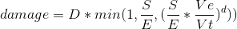

### Missile mechanics
[Datasource](https://wiki.eveuniversity.org/Missile_mechanics)

  

 .  | description  | notes
------------- | -------------  | -------------
D |	base damage of missile | The bigger the better 
S | signature radius of target | The bigger the better
E | explosion radius of missile | The smaller the better
Ve | explosion velocity of missile | The bigger the better
Vt | velocity of target | The smaller the better
d | damage reduction factor (drf) | The smaller the better

Missile | Explosion Radius | Explosion Velocity | Base Damage
------------- | ------------- | -------------  | -------------
Light Missile | 40 | 170  | 83
Rocket | 20 | 150 | 33
Heavy Missile | 140 | 81 | 135
Torpedo | 450 | 71 | 450 

Missile Type | DRF
------------- | -------------
Torpedo | 0.944
Rocket | 0.644
Rage Torpedo | 0.967
Rage Rocket | 0.882
Rage Heavy Assault Missile | 0.920
Precision Light Missile | 0.561
Precision Heavy Missile | 0.583
Precision Cruise Missile | 0.735
Light Missile | 0.604
Javelin Torpedo | 0.967
Javelin Rocket | 0.682
Javelin Heavy Assault Missile | 0.895
Heavy Missile | 0.682
Heavy Assault Missile | 0.882
Fury Light Missile | 0.682
Fury Heavy Missile | 0.882
Fury Cruise Missile | 0.908
Cruise Missile | 0.882
Citadel Torpedo | 1.00
Citadel Cruise Missile | 0.882
Auto-Targeting Light Missile | 0.604
Auto-Targeting Heavy Missile | 0.682
Auto-Targeting Cruise Missile | 0.882

###### links:
- [formula editor](https://www.codecogs.com/latex/eqneditor.php) 